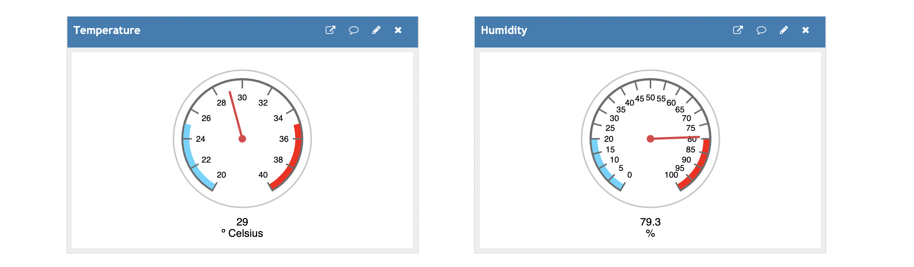
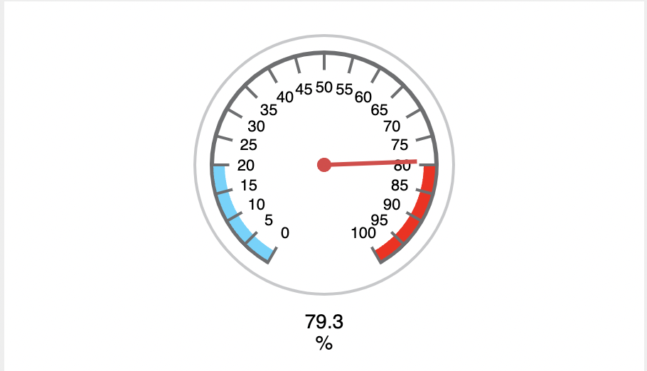

# ESW Lab 1

#### Arushi Mittal (2019101120)

### Project Description 

The project consists of a fully functional, end-to-end temperature and humidity monitoring system, equipped with cloud-based regular trend analyis and visual alerts whenever the temperature or humidity values exceed a particular threshold value.

### Use Case 

This set up can be used for monitoring the temperature and humidity of a dynamic environment with extremely small, fast-paced changes in the temperature and humidity of the surroundings. Additionally, it can also be used to analyze trends in temperature and humidity via graphs that are computed and stored on the cloud to transfer computational power. Additionally, visual gauge representations enable users to view the current values on a scale that indicates values that are too high, too low, or moderate. When the temperature exceeds a certain threshold value, in this case 30, we light up the green LED and turn it off when the temperature is below it. Similarly for humidity, if it is greater than 80% we turn on the red LED, otherwise we turn it off. The values for both are formatted and printed on serial monitor for easy viewing and understanding of trends. Since the sensitivity of a DHT22 sensor is very high and the values have less fluctuation and greater accuracy, this system can be used to analyze very small changes in the values as well.

### Files
- `Report.md` : Contains the report and information for the project.
- `code.ino`: Contains the Arduino IDE code to be dumped on the ESP32 board in order to run the program. The Wi-Fi SSID and Password need to be changed by users along with the writeAPIKey and ThingSpeak channel ID.
- `video.mov`: Contains the video which demonstrates the working of the detection system. This file can be found [here](https://iiitaphyd-my.sharepoint.com/:v:/g/personal/arushi_mittal_students_iiit_ac_in/EcwZsQISrJJPlaEsNCckA_ABmurGQIR8LUcU8WGfTndFUg?e=ZBcI85).

<!-- ### Graphs

### Gauges

 -->

### Temperature Graph from ThingSpeak

<!-- <figure class = "container">
<iframe width="450" height="260" style="border: 1px solid #cccccc;" src="https://thingspeak.com/channels/1502645/charts/1?bgcolor=%23ffffff&color=%23d62020&dynamic=true&results=60&title=Temperature&type=line"></iframe>
</figure>
 -->
### Humidity Graph from ThingSpeak

<!-- <figure class = "container">
<iframe width="450" height="260" style="border: 1px solid #cccccc;" src="https://thingspeak.com/channels/1502645/charts/2?bgcolor=%23ffffff&color=%23d62020&dynamic=true&results=60&title=Humidity&type=line"></iframe>
</figure> -->

### Temperature Gauge from ThingSpeak

<!-- 
<figure class = "container">
<iframe width="450" height="260" style="border: 1px solid #cccccc;" src="https://thingspeak.com/channels/1502645/widgets/356833"></iframe>
</figure> -->

### Humidity Gauge from ThingSpeak

<!-- 
<figure class = "container">
<iframe width="450" height="260" style="border: 1px solid #cccccc;" src="https://thingspeak.com/channels/1502645/widgets/356834"></iframe>
</figure> -->

### Circuit

The project makes use of a DHT22 sensor to detect changes in the temperature and humidity and send them through the input pin 27 to the ESP32 board, which uploads this data to the cloud. Additionally, a red and green LED are used to demonstrate crossing the threshold value for humidity and temperature respectively. Resistors are used to ensure the circuit functions as expected, along with wires and breadboards to integrate all the components together.

### Program Flow

After connecting to Wi-Fi using Wifi.h, we set up other libraries like ThingSpeak and DHT, as well as setting baud rate and initiating communication with the Serial monitor. After this the most important step is to set up the digitalWrite pins and sensor input pins. After the set up is complete, we set a loop that runs every 3 seconds to take sensor readings, upload to ThingSpeak, and reflect the same in the LEDs connected to the ESP32 board. This continues until the code is terminated.

